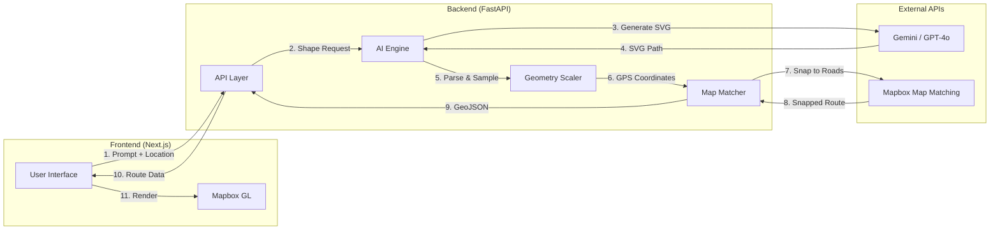
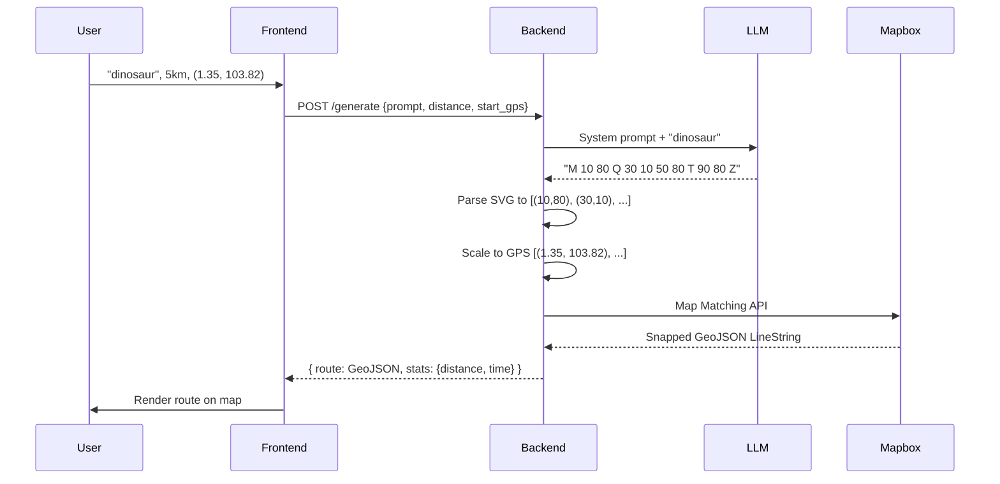

# PathArt System Architecture

## High-Level Flow

---

## Detailed Component Breakdown

### Frontend (Next.js + Ant Design + Mapbox GL)
| Component | Responsibility |
|-----------|----------------|
| `page.tsx` | Main UI using Ant Design (Card, Segmented, Button, TextArea) |
| `Map.tsx` | Renders Mapbox map and route overlays |
| `use-location.tsx` | Hook for browser Geolocation API |
| `api/` (future) | Calls to the backend API |

### Backend (FastAPI + Python)
| Component | Responsibility |
|-----------|----------------|
| **API Layer** | Receives prompt, distance, start GPS from frontend |
| **AI Engine** | Sends prompt to LLM with system instructions to get SVG path |
| **SVG Parser** | Uses `svg.path` to sample 20-30 (x,y) points from the path |
| **Geometry Scaler** | Converts 0-100 coordinates to Lat/Long based on distance |
| **Map Matcher** | Calls Mapbox Map Matching API to snap points to roads |
| **Cache** | Caches common shapes (e.g., "heart") to avoid repeated LLM calls |

### External APIs
| API | Purpose |
|-----|---------|
| **Gemini / GPT-4o** | Generates simplified SVG path from text description (V3) |
| **Mapbox Map Matching** | Snaps GPS coordinates to real roads/park connectors |

---

## AI Engine Iterations

```mermaid
flowchart TB
    subgraph V1["V1: Predefined Shapes"]
        V1A[User selects from<br/>curated shape library]
        V1B[Heart, Star, Dinosaur, etc.]
        V1A --> V1B
    end

    subgraph V2["V2: Custom Input"]
        V2A[User uploads image<br/>OR selects emoji]
        V2B[Backend extracts<br/>contour/silhouette]
        V2A --> V2B
    end

    subgraph V3["V3: LLM Generation"]
        V3A[User types text prompt]
        V3B[LLM generates<br/>SVG path]
        V3A --> V3B
    end

    V1 --> V2 --> V3

    style V1 fill:#2d4a3e,stroke:#4ade80
    style V2 fill:#3d3a4a,stroke:#a78bfa
    style V3 fill:#4a3d3d,stroke:#f87171
```

| Version | Input | Backend Logic | Complexity |
|---------|-------|---------------|------------|
| **V1** | Select from gallery | Lookup predefined SVG paths | Low |
| **V2** | Upload image / Emoji | Image → Contour extraction (OpenCV) | Medium |
| **V3** | Text prompt | LLM → SVG path generation | High |

> [!TIP]
> Start with **V1** for the hackathon MVP. V2 and V3 can be stretch goals.

**User Input:** "A 5km route shaped like a dinosaur starting from my location"

